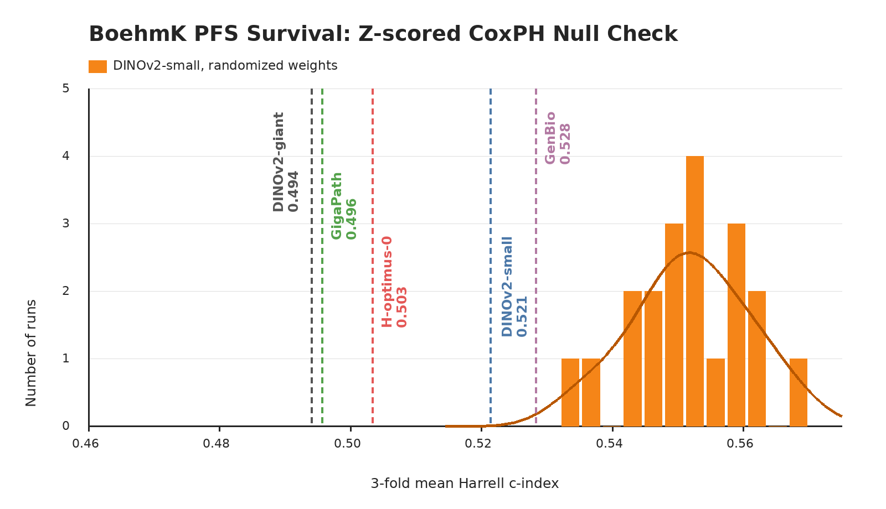

# BoehmK Survival

## Role In Nanopath

`boehmk_pfs` is an ovarian slide-level survival probe. Upstream PathoBench calls the endpoint PFS, short for progression-free survival. It contributes Harrell's validation c-index as one of the two datasets averaged into the README survival column.

## Source

- Labels: `MahmoodLab/Patho-Bench`, file `boehmk_/PFS/k=all.tsv`
- Upstream metadata: `task_type: survival`, `metrics: cindex`, with `PFS_event` and `PFS_days`
- Raw WSIs: BOEHMK Synapse project at `https://www.synapse.org/Synapse:syn25946117/wiki/611576`
- Portable setup mirror: `medarc/nanopath`, under `probes/boehmk_pfs/`

## Split And Patches

Nanopath vendors `boehmk_pfs.json`, derived from PathoBench BOEHMK survival/PFS fold_0. PathoBench fold_0 test remains held out; Nanopath uses deterministic 3-fold event-stratified validation over the fold_0 train pool.

| split | cases/slides | event labels | cached patches |
|---|---:|---|---:|
| train pool | 146 | 96 event / 50 censored | 271,467 cached 20x/512 tissue tiles |
| per-fold train | 97-98 | reused | reused |
| per-fold val | 48-49 | reused | reused |
| held-out PathoBench test | 37 | 24 event / 13 censored | not read |

## Implementation

`prepare.py` normally downloads the pre-extracted `medarc/nanopath` parquet cache: `patches.parquet`, `labels.tsv`, and `tiling_version.txt`. `fetch_boehmk_pfs_from_synapse()` is the regeneration helper for rebuilding that mirror after the user has accepted the BOEHMK Synapse access terms. It downloads the Synapse `data.tar.gz`, extracts a deterministic 20x, 512 px, 0-overlap tissue grid, and writes one combined `patches.parquet`.

`probe.py` streams a deterministic raster-spaced sub-bag of up to 768 cached patches per slide with a no-crop square resize, mean-pools patch embeddings by slide, pools by case unit, z-scores features with train-fold statistics, and fits `sksurv.linear_model.CoxPHSurvivalAnalysis(alpha=2.0)` on the full standardized feature matrix. It reports the mean validation Harrell's c-index across the three event-stratified folds. The head has no dimensionality reduction, elastic-net sparsity, or alpha sweep.

## Null Distribution Audit

`plot_null_checks.py` generates the figure above. The orange null is a June 2, 2026 current-code rerun that constructs a new randomized-weight DINOv2-small for each seed before calling `probe.py`: mean 0.5518, std 0.0085, max 0.5683. Fixed checkpoints are shown as vertical references: DINOv2-small 0.521, DINOv2-giant 0.494, GigaPath 0.496, GenBio-PathFM 0.528, and H-optimus-0 0.503.

## Difference From Original Usage

PathoBench's BOEHMK survival task reports Harrell's c-index. PathoBench is designed for standardized task evaluation across folds and pools Trident patch embeddings. Nanopath keeps the same 20x/512 patch-grid cache, uses a deterministic up-to-768-tile sub-bag for final-probe runtime, and uses repeated train-derived internal validation for fast iteration without scoring the PathoBench test fold. The survival head is intentionally simple and fixed: train-fold z-scored pooled features into CoxPH alpha 2.0. The ridge penalty preserves all embedding dimensions and avoids turning the probe into a sparse feature-selection benchmark, while standardization keeps the penalty scale-comparable. The tissue mask is a lightweight deterministic thumbnail mask rather than Trident HEST segmentation.

## Runtime

On June 2, 2026 H100 survival-only probes, the deterministic 768-tile sub-bag embedded 85,803 tiles and took 100.7s for DINOv2-S random, 101.0s for DINOv2-S, 726.5s for DINOv2-G, 246.2s for OpenMidnight, 233.4s for H-optimus-0, 95.8s for the current Nanopath main model, and 1601.6s for GenBio-PathFM. High-dimensional fixed-ridge CoxPH fits, especially Virchow and GenBio-PathFM, are CPU-bound after embedding.
