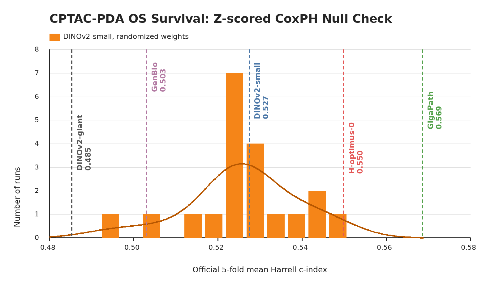

# CPTAC-PDA OS

`cptac_pda_os` is a pancreatic ductal adenocarcinoma case-level overall-survival probe from PathoBench. It contributes Harrell's c-index averaged over the official five PathoBench folds as one of the two datasets averaged into the README survival column.

## Source

- Dataset: [PathoBench](https://huggingface.co/datasets/MahmoodLab/Patho-Bench) `cptac_pda/OS`
- Labels: `MahmoodLab/Patho-Bench`, file `cptac_pda/OS/k=all.tsv`
- Upstream metadata: `task_type: survival`, `metrics: cindex`, with `OS_event` and `OS_days`
- Slide source: [TCIA CPTAC-PDA](https://www.cancerimagingarchive.net/collection/cptac-pda/) pathology images exposed by [PathDB](https://pathdb.cancerimagingarchive.net/imagesearch?f%5B0%5D=collection%3Acptac-pda)
- Local cluster cache: `/data/CPTAC-PDA`

## Split

Nanopath vendors `cptac_pda_os.json`, derived directly from PathoBench `k=all.tsv`. The task is case-level, not slide-level: the JSON maps 97 CPTAC-PDA case ids to 227 PathDB SVS slide ids, with 71 observed events and 26 censored cases. PathoBench defines this survival task by five official folds, each with 77-78 train cases and 19-20 held-out cases, so Nanopath reports the mean c-index across those five folds instead of carving a separate validation split.

## Probe Implementation

`prepare.py download=True` can now build this cache from public official sources on a fresh clone. It downloads each needed `{slide_id}.svs` from TCIA PathDB, extracts a deterministic 20x, 512 px, 0-overlap tissue grid with the same lightweight thumbnail tissue mask used by the other PathoBench-derived slide probes, writes one resumable full-grid parquet per slide, then concatenates them into:

- `patches.parquet`: `case_id`, `slide_id`, `tile_idx`, `image`
- `labels.tsv`: `case_id`, `slide_id`, `OS_event`, `OS_days`
- `tiling_version.txt`: `pathobench_20x_512_v1_full`

The local cache currently contains 146,896 JPEG tiles. The PathDB server does not reliably expose `Content-Length`, so the CPTAC path intentionally streams the SVS files directly instead of using the size-checked downloader used for SurGen CZI files.

`probe.py` streams cached tiles with a no-crop square resize, mean-pools tile embeddings by slide, mean-pools slides by case, then fits the same fixed survival head on each official fold:

```text
train-fold z-score -> CoxPHSurvivalAnalysis(alpha=2.0)
```

This intentionally differs from PathoBench's default elastic-net Coxnet head. Nanopath compares many custom frozen backbones, so the survival probe uses the same fixed ridge Cox head for every model, preserves all embedding dimensions, standardizes feature scale within each train fold, avoids sparse feature selection, and avoids alpha/l1 sweeps.

## Null Distribution Audit



`plot_null_checks.py` generates the figure above. The orange null is a June 2, 2026 current-code rerun that constructs a new randomized-weight DINOv2-small for each seed before calling `probe.py`: mean 0.5260, std 0.0126, max 0.5489. Fixed checkpoints are shown as vertical references: DINOv2-small 0.527, DINOv2-giant 0.485, GigaPath 0.569, GenBio-PathFM 0.503, and H-optimus-0 0.550.

## Difference From Original Usage

This is PathoBench-derived but still adapted for Nanopath's fast single-GPU loop. Nanopath uses the official PathoBench case folds and c-index metric, but evaluates custom-backbone mean-pooled tile features instead of Trident embeddings and uses train-fold z-scored fixed-ridge CoxPH rather than elastic-net Coxnet. The tissue mask is a lightweight deterministic thumbnail mask rather than Trident HEST segmentation, so this should be interpreted as a compact representation probe, not as a claim about the best possible CPTAC-PDA survival model.
